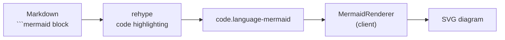

## The posts had no pictures

At the end of [Part 10: UX Improvements (2) — Navigation and Discovery](/en/posts/navigation-and-discovery), I wrote "next up is Mermaid" and then put it off. The reason was simple: it wasn't an urgent fire. But once I started writing the Prometheus series, the problem became obvious. Explaining an architecture in prose alone turned whole paragraphs into strings of "A sends a request to B, B passes through C and stores it in D…" — the kind of thing a single picture would settle.

As it happens, my own series guide says "use Mermaid diagrams for architecture and flow charts." Yet the blog itself would just show a ` ```mermaid ` block as a plain gray code box. The rule existed; the rendering didn't. This post is about turning those code blocks into actual SVG diagrams.

***

## When to draw — build time vs. client

There were two broad ways to add Mermaid: bake the SVG into the HTML at build time, or draw it in the browser.

| Approach | Pros | Cons |
| --- | --- | --- |
| Build time (rehype plugin + SSR) | SVG ships in the initial HTML, visible without JS | Mermaid depends on the browser DOM → needs jsdom at build, dark mode is awkward |
| Client rendering | Instant dark/light theme switching, simpler setup | Diagrams appear slightly after the first paint |

The blog is a **static site (`output: export`)** hosted on GitHub Pages, so there's no SSR step. Baking SVG at build time would mean running Mermaid in Node, and Mermaid relies on browser DOM APIs internally — meaning a fake DOM like jsdom. Even then, the decisive problem remains: **dark mode.** If colors are frozen at build time, toggling the theme leaves the diagram stuck in the old palette.

So I went with **client rendering**. Dark mode toggling happens in the browser anyway, and redrawing when the theme changes is trivial. The static-site constraint actually made the choice simpler.

***

## Intercepting the code block

I left the existing markdown pipeline untouched. When the body renders, a ` ```mermaid ` block lands in the DOM just like any other code block: `<pre><code class="language-mermaid">...</code></pre>`. The job is to pick out the ones with the `language-mermaid` class and swap them for a Mermaid-drawn SVG.



The `MermaidRenderer` client component handles this flow. Drop one line into the post page (`page.tsx`) and it scans the body on mount.

```tsx
// src/components/MermaidRenderer.tsx
const codeBlocks = document.querySelectorAll<HTMLElement>(
  "code.language-mermaid"
);
if (codeBlocks.length === 0) return;

codeBlocks.forEach((block) => {
  const pre = block.parentElement;
  if (!pre || pre.tagName !== "PRE") return;

  const source = block.textContent || "";
  const wrapper = document.createElement("div");
  wrapper.className = "mermaid-diagram";
  pre.replaceWith(wrapper);          // swap <pre> for an empty div
  diagrams.push({ source, wrapper });
});
```

It replaces the entire `<pre>` with an empty `<div class="mermaid-diagram">` and stashes the original text separately. The actual drawing comes next.

```tsx
// src/components/MermaidRenderer.tsx
async function renderAll() {
  const mod = await import("mermaid");      // dynamic import
  const mermaid = mod.default;
  const isDark = document.documentElement.classList.contains("dark");

  mermaid.initialize({
    startOnLoad: false,
    theme: "base",
    fontFamily: "inherit",
    themeVariables: isDark ? darkTheme : lightTheme,
  });

  for (let i = 0; i < diagrams.length; i++) {
    const { source, wrapper } = diagrams[i];
    const id = `mermaid-${Date.now()}-${i}`;
    const { svg } = await mermaid.render(id, source);
    wrapper.innerHTML = svg;
  }
}
```

The key line is `await import("mermaid")`. A static import would bundle the entire Mermaid library into every post — even though most posts have no diagrams at all. **Switching to a dynamic import means the library only downloads on posts that actually contain a `language-mermaid` block.** Deferring a heavy dependency until the moment it's needed was the single highest-leverage line in this work.

***

## The rough edges

### Toggling dark mode didn't change the diagram

At first I figured drawing once on mount would do. But pressing the dark mode button changed the text and background colors while the diagram stayed in the old theme. `mermaid.initialize` only bakes the SVG once with the theme at that moment; it doesn't repaint an already-rendered SVG when the theme changes later.

The fix was to **detect the theme switch with a `MutationObserver` and redraw**. Dark mode on this blog works by toggling a `dark` class on the `<html>` element. I watch only that class for changes and call `renderAll` again when it flips.

```tsx
// src/components/MermaidRenderer.tsx
const observer = new MutationObserver((mutations) => {
  for (const mutation of mutations) {
    if (
      mutation.type === "attributes" &&
      mutation.attributeName === "class"
    ) {
      renderAll();
    }
  }
});
observer.observe(document.documentElement, { attributes: true });

return () => observer.disconnect();
```

### The default theme didn't fit the blog

Mermaid's built-in `dark` theme leans on saturated purples and pinks that clashed with the blog's calmer palette. I kept `theme: "base"` and fed the blog's own colors into `themeVariables`, building two sets for light and dark — node background, border, line color, text, all matched by hand.

| Variable | Dark | Light | Use |
| --- | --- | --- | --- |
| `mainBkg` | `#2a2a3e` | `#e5e7eb` | Node background |
| `nodeBorder` | `#3e3e5e` | `#6b7280` | Node border |
| `lineColor` | `#6b7280` | `#374151` | Arrows/lines |
| `textColor` | `#d1d5db` | `#111827` | Text |

`fontFamily: "inherit"` is a small detail too — so the diagram's typeface doesn't drift from the body text.

### The code block flashed and vanished

For a brief moment before the JS ran, the raw ` ```mermaid ` text appeared as a gray code box and then swapped to SVG. A classic FOUC. I blocked it by hiding the raw code block from the start with CSS.

```css
/* src/app/globals.css */
pre:has(> code.language-mermaid) {
  display: none;
}

.mermaid-diagram {
  animation: mermaid-fade-in 0.4s ease-out;
}
```

The `:has()` selector pinpoints only the `<pre>` that has a `language-mermaid` code child and hides it. The replaced `.mermaid-diagram` then fades in, visually covering the one downside of client rendering — that the picture shows up a touch late.

### `render` needs a unique id

The first argument to `mermaid.render(id, source)` is the id for a temporary SVG element. With several diagrams on one page, identical ids collide and the later one overwrites the earlier. Mixing the timestamp and index as `mermaid-${Date.now()}-${i}` keeps each one unique.

***

## Wrap-up

| Item | Choice | Reason |
| --- | --- | --- |
| Render timing | Client | Static site, no SSR + instant dark mode |
| Library load | Dynamic `import` | Bundle downloads only on posts with diagrams |
| Code block handling | Replace `<pre>` with a div | No changes to the markdown pipeline |
| Dark mode | `MutationObserver` + redraw | Watches the `<html>.dark` class |
| Theme | `base` + custom `themeVariables` | Colors matched to the blog palette |
| FOUC | `pre:has()` hide + fade-in | Stops the raw code flash |

I filled in a box that had sat empty as a rule alone for almost a year. Now writing ` ```mermaid ` actually produces a diagram. The real effort went not into wiring up the library but into matching colors with dark mode. That one picture replaces three paragraphs — the flowchart above this section is the proof.

The next post covers splitting series in the sidebar and the mobile filter.
