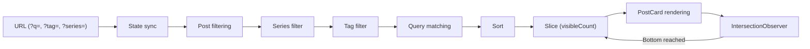

## From Features to UX

Up through [Part 7: Copy Protection and SEO in One Shot](/en/posts/copy-protection-and-seo), the focus was on building features — API, auth, i18n, copy protection. The skeleton was there, but the actual experience of using the blog felt rough. Once I passed ten posts, tag filtering alone couldn't keep up. And writing at night with a white screen searing my eyes wasn't great either. It was time to polish the UX.

This post covers two things: **search** and **dark mode**.

***

## Why Search Was Needed

With five or six posts, tag filters and series filters were enough. Past ten, things changed. I'd think "what was that post about again?" and if I couldn't remember the tag, the only option was scrolling through the full list. I needed a way to search by keywords in titles and descriptions.

***

## Choosing a Search Approach

There are roughly three options for search on a static blog.

| Option | Characteristics | Fit |
| --- | --- | --- |
| Fuse.js | Fuzzy matching, typo-tolerant, ~17KB bundle | Better for hundreds of posts |
| Lunr.js | Inverted index, pre-buildable | English-centric; Korean needs a custom tokenizer |
| DIY (`includes()`) | No dependencies, exact match only | Sufficient when post count is low |

**I went with DIY.** Pulling in a fuzzy matching library for a blog with fewer than 20 posts felt like overkill. Matching against `title`, `description`, and `tags` with `includes()` covers the need, and swapping in Fuse.js later when the post count grows is trivial.

***

## Building the Search

### Search Logic

The search logic is almost comically simple.

```typescript
// src/lib/searchPosts.ts
export function matchesQuery(post: PostMeta, query: string): boolean {
  const q = query.toLowerCase();
  return (
    post.title.toLowerCase().includes(q) ||
    post.description.toLowerCase().includes(q) ||
    post.tags.some((tag) => tag.toLowerCase().includes(q))
  );
}
```

One function, under ten lines. Convert the query to lowercase, run `includes()` against three fields. Korean works without any special handling. That's it.

### Search UI

The input itself is straightforward, but I added a few UX touches.

| Feature | Implementation |
| --- | --- |
| Keyboard shortcut | `⌘K` (Mac) / `Ctrl+K` (Windows) focuses the input |
| OS detection | `navigator.userAgent` to show the right shortcut badge |
| Clear button | X button appears when there's a query; clicking it clears and re-focuses |
| Badge auto-hide | Shortcut badge disappears on focus or when a query exists |

```typescript
// src/components/SearchInput.tsx (shortcut handling)
useEffect(() => {
  function handleKeyDown(e: KeyboardEvent) {
    if ((e.metaKey || e.ctrlKey) && e.key === "k") {
      e.preventDefault();
      inputRef.current?.focus();
    }
  }
  document.addEventListener("keydown", handleKeyDown);
  return () => document.removeEventListener("keydown", handleKeyDown);
}, []);
```

Pressing `⌘K` moves focus to the search box. `e.preventDefault()` blocks the browser default (like focusing the address bar). OS detection checks `navigator.userAgent` for `Mac|iPhone|iPad` — if found, show `⌘K`; otherwise, `Ctrl+K`.

### Highlight and URL Sync

To visually distinguish matched text in search results, I wrapped matches in `<mark>` tags.

```typescript
// src/lib/highlightText.tsx (core excerpt)
const escaped = escapeRegex(query);
const regex = new RegExp(`(${escaped})`, "gi");
const parts = text.split(regex);

return (
  <>
    {parts.map((part, i) =>
      regex.test(part) ? (
        <mark key={i} className="bg-yellow-200/60 dark:bg-yellow-400/20 ...">
          {part}
        </mark>
      ) : (
        part
      )
    )}
  </>
);
```

The text is split by regex, and matching fragments are wrapped in `<mark>`. In dark mode, `bg-yellow-400/20` keeps the highlight subtle. Special characters are escaped with `escapeRegex` — users might search for `(` or `)`.

URL synchronization uses `replaceState`.

```typescript
// src/components/HomeContent.tsx (URL sync)
if (searchQuery.trim()) params.set("q", searchQuery.trim());
window.history.replaceState(null, "", newUrl);
```

Typing a search query reflects it in the URL as `?q=query`. I used `replaceState` instead of `pushState` because each keystroke would otherwise push a history entry, making the back button unusable. Since the query lives in the URL, a page refresh preserves the search state.

***

## Search + Filters + Infinite Scroll

Search doesn't operate in isolation. It works alongside tag filters, series filters, and infinite scroll. Here's the data flow.



**Filtering uses AND logic.** If a series is selected, only posts in that series remain. If a tag is also active, it filters within that set. If there's a search query, it filters once more. Only posts passing all three conditions appear on screen.

Infinite scroll is powered by `IntersectionObserver`. An empty `div` sits at the bottom of the page; when it enters the viewport, `visibleCount` increments by 5. Changing a filter or search query resets `visibleCount` to 5.

```typescript
// src/components/HomeContent.tsx (infinite scroll)
const observer = new IntersectionObserver(
  (entries) => {
    if (entries[0].isIntersecting) loadMore();
  },
  { rootMargin: "200px" }
);
```

`rootMargin: "200px"` triggers loading 200px before actually reaching the bottom, so posts appear seamlessly as the user scrolls.

***

## Dark Mode as the Default

The reasoning was simple. **The primary audience of a dev blog is developers, and most prefer dark mode.** IDEs are dark, terminals are dark — a blinding blog breaks the flow. I considered reading `prefers-color-scheme` to follow the system setting, but that gets complicated when someone runs a light OS theme but wants a dark browser experience. A clean default-dark with a toggle felt right.

***

## The FOUC Problem

Implementing dark mode in an SSR/SSG environment almost inevitably leads to **FOUC (Flash of Unstyled Content)** — a brief light-mode flash before dark mode kicks in.

The cause: Next.js generates HTML at build time without access to `localStorage`. The browser renders the HTML first, then JS loads, reads the theme from `localStorage`, and toggles the class. During that gap of a few hundred milliseconds, the default style (light) is visible.

The fix is an inline script in `<head>` that **sets the class during HTML parsing, before any rendering**.

```typescript
// src/app/layout.tsx
<html className={`dark ${fonts} h-full scroll-smooth`}>
  <head>
    <script
      dangerouslySetInnerHTML={{
        __html: `(function(){var t=localStorage.getItem('theme');document.documentElement.classList.toggle('dark',t?t==='dark':true)})()`,
      }}
    />
  </head>
```

Two things are happening here.

1. The `<html>` tag starts with `dark` in its class list. Even before the script runs, the page renders in dark mode.
2. The inline `<head>` script reads `localStorage` and toggles the `dark` class. If `'light'` is stored, it removes `dark`; otherwise, it keeps it.

Because this script is inside `<head>`, it executes before `<body>` rendering begins. FOUC is eliminated at the source.

***

## Dark Mode in Tailwind 4

Tailwind 4 changed how dark mode is configured. Instead of the old `darkMode: 'class'` option, it's declared at the CSS level with `@custom-variant`.

```css
/* src/app/globals.css */
@custom-variant dark (&:where(.dark, .dark *));

:root {
  --background: #ffffff;
  --foreground: #111827;
}

.dark {
  --background: #030712;
  --foreground: #f9fafb;
}
```

`@custom-variant dark` activates the `dark:` prefix for elements with a `.dark` class and their descendants. Declaring light variables on `:root` and dark variables on `.dark` lets Tailwind utilities like `dark:bg-gray-950` and CSS custom properties work in tandem.

Code block backgrounds use a Catppuccin Mocha palette (`#1e1e2e`). This ties into the copy button color split covered in [Part 7](/en/posts/copy-protection-and-seo).

***

## Preventing Hydration Mismatch

One more detail in the `ThemeToggle` component.

```typescript
// src/components/ThemeToggle.tsx
const [dark, setDark] = useState(true);

useEffect(() => {
  setDark(document.documentElement.classList.contains("dark"));
}, []);
```

The initial state is `useState(true)` — **defaulting to dark**. This value is used during server rendering, and since the `<html>` tag also defaults to class `dark`, the server and client initial states match. Setting it to `useState(false)` would render a light-mode icon on the server while the client renders a dark-mode icon, triggering a hydration mismatch.

The `useEffect` reads the actual DOM state after mount to correct the value. If the user previously chose light mode (causing the `<head>` inline script to remove the `dark` class), `classList.contains("dark")` returns `false` at mount time, and the icon updates accordingly.

| Timing | Server Render | Client Render |
| --- | --- | --- |
| Initial | `dark = true` (moon icon) | `dark = true` (moon icon) — no mismatch |
| After mount | — | Reads actual class from DOM, adjusts if needed |

***

## Recap

| Item | Choice | Rationale |
| --- | --- | --- |
| Search library | DIY (`includes()`) | Low post count, minimal dependencies |
| Search scope | title + description + tags | Full-text search would be overkill |
| URL sync | `replaceState` | Avoid polluting history on each keystroke |
| Infinite scroll | `IntersectionObserver` | Smoother browsing than pagination |
| Dark mode default | Dark | Dev blog audience, consistency with code blocks |
| FOUC prevention | Inline `<head>` script | Sets class during HTML parsing |
| Hydration handling | `useState(true)` + DOM read on mount | Matches server/client initial state |

Search works fine without external libraries at this scale. With dark mode, FOUC prevention and hydration mismatch are the real challenges — the toggle itself is the easy part. Next up, I'll cover navigation and browsing UX.
