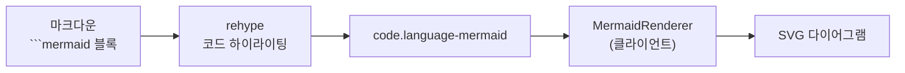

## 글에 그림이 없었다

[10편: UX 개선기 (하) — 네비게이션과 탐색](/ko/posts/navigation-and-discovery) 끝에 "다음 편은 Mermaid"라고 적어놓고 미뤄둔 작업이다. 미룬 이유는 단순했다. 당장 급한 불이 아니었으니까. 그런데 Prometheus 시리즈를 쓰기 시작하면서 문제가 분명해졌다. 아키텍처를 글로만 설명하니 한 문단이 통째로 "A가 B에게 요청을 보내고 B는 C를 거쳐 D에 저장하고…" 같은 말의 나열이 됐다. 그림 하나면 끝날 이야기였다.

마침 시리즈 가이드에는 "아키텍처/흐름도는 Mermaid 다이어그램을 사용한다"고 내가 직접 못을 박아놨었다. 정작 블로그는 ` ```mermaid ` 코드블록을 넣어도 그냥 회색 코드 상자로 보여줄 뿐이었다. 규칙만 있고 렌더링이 없었다. 이번 편은 그 코드블록을 실제 SVG 다이어그램으로 바꾸는 작업이다.

***

## 언제 그릴 것인가 — 빌드 타임 vs 클라이언트

Mermaid를 붙이는 방법은 크게 두 갈래였다. 빌드할 때 미리 SVG로 구워 HTML에 박아넣느냐, 아니면 브라우저에서 그리느냐.

| 방식 | 장점 | 단점 |
| --- | --- | --- |
| 빌드 타임 (rehype 플러그인 + SSR) | 초기 HTML에 SVG 포함, JS 없이도 보임 | Mermaid가 브라우저 DOM에 의존 → 빌드에 jsdom 필요, 다크모드 대응 까다로움 |
| 클라이언트 렌더링 | 다크/라이트 테마 즉시 전환, 설정 단순 | 초기 렌더 후 그림이 살짝 늦게 뜸 |

블로그는 GitHub Pages에 올리는 **정적 사이트(`output: export`)**라 SSR 단계가 없다. 빌드 타임에 SVG를 굽자면 Mermaid를 Node 환경에서 돌려야 하는데, Mermaid는 내부적으로 브라우저 DOM API를 쓰기 때문에 jsdom 같은 가짜 DOM을 깔아야 한다. 거기까지 가도 결정적인 문제가 남는다. **다크모드 토글이다.** 빌드 시점에 색을 박아버리면 사용자가 테마를 바꿔도 다이어그램만 옛 색으로 남는다.

그래서 **클라이언트 렌더링**을 택했다. 어차피 다크모드 전환은 브라우저에서 일어나는 일이고, 테마가 바뀔 때 다시 그리면 그만이다. 정적 사이트라는 제약이 오히려 선택을 단순하게 만들어줬다.

***

## 코드블록을 가로채는 구조

기존 마크다운 파이프라인은 손대지 않았다. 본문이 렌더링되면 ` ```mermaid ` 블록은 다른 코드블록과 똑같이 `<pre><code class="language-mermaid">...</code></pre>` 형태로 DOM에 들어온다. 할 일은 그중 `language-mermaid` 클래스를 가진 것만 골라내 Mermaid가 그린 SVG로 갈아끼우는 것이다.



이 흐름을 담당하는 게 `MermaidRenderer`라는 클라이언트 컴포넌트다. 포스트 페이지(`page.tsx`)에 한 줄 얹어두면 마운트될 때 본문을 훑는다.

```tsx
// src/components/MermaidRenderer.tsx
const codeBlocks = document.querySelectorAll<HTMLElement>(
  "code.language-mermaid"
);
if (codeBlocks.length === 0) return;

codeBlocks.forEach((block) => {
  const pre = block.parentElement;
  if (!pre || pre.tagName !== "PRE") return;

  const source = block.textContent || "";
  const wrapper = document.createElement("div");
  wrapper.className = "mermaid-diagram";
  pre.replaceWith(wrapper);          // <pre>를 빈 div로 교체
  diagrams.push({ source, wrapper });
});
```

`<pre>`를 통째로 빈 `<div class="mermaid-diagram">`로 갈아끼우고, 원본 텍스트만 따로 모아둔다. 실제 그리기는 그다음이다.

```tsx
// src/components/MermaidRenderer.tsx
async function renderAll() {
  const mod = await import("mermaid");      // 동적 import
  const mermaid = mod.default;
  const isDark = document.documentElement.classList.contains("dark");

  mermaid.initialize({
    startOnLoad: false,
    theme: "base",
    fontFamily: "inherit",
    themeVariables: isDark ? darkTheme : lightTheme,
  });

  for (let i = 0; i < diagrams.length; i++) {
    const { source, wrapper } = diagrams[i];
    const id = `mermaid-${Date.now()}-${i}`;
    const { svg } = await mermaid.render(id, source);
    wrapper.innerHTML = svg;
  }
}
```

핵심은 `await import("mermaid")`다. 정적 import로 박아두면 Mermaid 라이브러리 전체가 모든 포스트 번들에 따라붙는다. 다이어그램이 없는 포스트가 훨씬 많은데 말이다. **동적 import로 바꾸니 `language-mermaid` 블록이 실제로 있는 글에서만 라이브러리를 내려받는다.** 무거운 의존성을 필요한 순간까지 미루는, 이 작업에서 가장 이득이 큰 한 줄이었다.

***

## 삽질 기록

### 다크모드를 토글해도 그림은 안 바뀐다

처음엔 마운트될 때 한 번만 그리면 된다고 생각했다. 그런데 다크모드 버튼을 누르면 글자색·배경은 다 바뀌는데 다이어그램만 옛 테마로 남았다. `mermaid.initialize`는 그 시점의 테마로 SVG를 한 번 구워낼 뿐, 나중에 테마가 바뀌어도 이미 그려둔 SVG를 다시 칠해주지 않기 때문이다.

해결은 **`MutationObserver`로 테마 전환을 감지해 다시 그리는 것**이었다. 이 블로그의 다크모드는 `<html>` 엘리먼트의 `dark` 클래스 토글로 동작한다. 그 클래스 변화만 지켜보다가 바뀌면 `renderAll`을 다시 호출한다.

```tsx
// src/components/MermaidRenderer.tsx
const observer = new MutationObserver((mutations) => {
  for (const mutation of mutations) {
    if (
      mutation.type === "attributes" &&
      mutation.attributeName === "class"
    ) {
      renderAll();
    }
  }
});
observer.observe(document.documentElement, { attributes: true });

return () => observer.disconnect();
```

### 기본 테마가 블로그와 안 어울린다

Mermaid의 내장 `dark` 테마는 채도 높은 보라·분홍 계열이라 블로그의 차분한 색감과 따로 놀았다. `theme: "base"`로 두고 `themeVariables`에 블로그 팔레트를 직접 넣어 라이트/다크 두 벌을 만들었다. 노드 배경, 테두리, 선 색, 글자색까지 손으로 맞췄다.

| 변수 | 다크 | 라이트 | 용도 |
| --- | --- | --- | --- |
| `mainBkg` | `#2a2a3e` | `#e5e7eb` | 노드 배경 |
| `nodeBorder` | `#3e3e5e` | `#6b7280` | 노드 테두리 |
| `lineColor` | `#6b7280` | `#374151` | 화살표·선 |
| `textColor` | `#d1d5db` | `#111827` | 글자 |

`fontFamily: "inherit"`로 둔 것도 작은 디테일이다. 다이어그램 글꼴이 본문과 따로 놀지 않게.

### 코드블록이 깜빡 보였다 사라진다

JS가 실행되기 전 아주 짧은 순간, 원본 ` ```mermaid ` 텍스트가 회색 코드 상자로 노출됐다가 SVG로 바뀌었다. 전형적인 FOUC(스타일 적용 전 깜빡임)다. CSS로 raw 코드블록을 처음부터 숨겨 막았다.

```css
/* src/app/globals.css */
pre:has(> code.language-mermaid) {
  display: none;
}

.mermaid-diagram {
  animation: mermaid-fade-in 0.4s ease-out;
}
```

`:has()` 선택자로 "`language-mermaid` 코드를 자식으로 둔 `<pre>`"만 콕 집어 숨긴다. 그리고 교체된 `.mermaid-diagram`은 페이드인으로 부드럽게 등장시켜, 그림이 살짝 늦게 뜨는 클라이언트 렌더링의 단점을 시각적으로 덮었다.

### `render`에는 고유 id가 필요하다

`mermaid.render(id, source)`의 첫 인자는 임시 SVG 엘리먼트에 쓸 id다. 한 페이지에 다이어그램이 여러 개면 id가 겹쳐 뒤엣것이 앞엣것을 덮어쓴다. `mermaid-${Date.now()}-${i}`로 시각과 인덱스를 섞어 매번 유일하게 만들었다.

***

## 정리

| 항목 | 선택 | 이유 |
| --- | --- | --- |
| 렌더링 시점 | 클라이언트 | 정적 사이트라 SSR 없음 + 다크모드 즉시 대응 |
| 라이브러리 로드 | 동적 `import` | 다이어그램 있는 글에서만 번들 다운로드 |
| 코드블록 처리 | `<pre>`를 div로 교체 | 기존 마크다운 파이프라인 무수정 |
| 다크모드 | `MutationObserver` + 재렌더 | `<html>.dark` 클래스 변화 감지 |
| 테마 | `base` + 커스텀 `themeVariables` | 블로그 팔레트에 색 직접 맞춤 |
| FOUC | `pre:has()` 숨김 + 페이드인 | 원본 코드 깜빡임 차단 |

규칙으로만 적어두고 1년 가까이 비워뒀던 칸을 채웠다. 이제 ` ```mermaid `라고 적으면 다이어그램이 뜬다. 정작 손이 많이 간 건 라이브러리 연동이 아니라 다크모드와 색을 맞추는 일이었다. 그림 하나가 글 세 문단을 대신한다는 건, 이 글 위쪽의 흐름도 하나가 증명한다.

다음 편에서는 사이드바의 시리즈 분리와 모바일 필터 작업을 다룬다.
