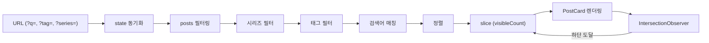

## 기능에서 UX로

[7편: 복사 방지와 SEO 한방에 잡기](/ko/posts/copy-protection-and-seo)까지는 기능 구현에 집중했다. API, 인증, 다국어, 복사 방지 — 하나씩 붙이다 보니 블로그의 뼈대는 갖춰졌는데, 정작 사용 경험은 투박했다. 포스트가 열 개를 넘어가면서 태그 필터만으로는 원하는 글을 찾기 어려웠고, 밤에 글을 쓸 때마다 흰 화면이 눈을 찔렀다. UX를 다듬을 타이밍이었다.

이번 편에서는 **검색 기능**과 **다크모드**, 두 가지를 다룬다.

***

## 검색이 필요한 이유

포스트가 5~6개일 때는 태그 필터와 시리즈 필터만으로 충분했다. 그런데 10개를 넘기면서 상황이 달라졌다. "그 글이 뭐였더라" 하고 떠올리는데, 태그가 기억나지 않으면 전체 목록을 스크롤해야 했다. 제목이나 설명에 포함된 키워드로 바로 찾을 수 있는 검색이 필요했다.

***

## 검색 라이브러리 선택

정적 블로그에서 검색을 구현하는 선택지는 크게 세 가지다.

| 선택지 | 특징 | 적합도 |
| --- | --- | --- |
| Fuse.js | 퍼지 매칭, 오타 허용, 번들 ~17KB | 포스트 수백 개 이상일 때 유리 |
| Lunr.js | 역인덱스 기반, 사전 빌드 가능 | 영문 중심, 한글 토크나이저 별도 필요 |
| 직접 구현 (`includes()`) | 의존성 없음, 정확 매칭만 | 포스트 수 적을 때 충분 |

**직접 구현을 선택했다.** 포스트가 20개도 안 되는 블로그에 퍼지 매칭 라이브러리를 붙이는 건 배보다 배꼽이 크다. `title`, `description`, `tags` 세 필드만 `includes()`로 비교하면 충분하고, 나중에 포스트가 수백 개로 늘어나면 그때 Fuse.js로 교체해도 늦지 않다.

***

## 검색 구현

### 검색 로직

검색 로직은 놀라울 정도로 단순하다.

```typescript
// src/lib/searchPosts.ts
export function matchesQuery(post: PostMeta, query: string): boolean {
  const q = query.toLowerCase();
  return (
    post.title.toLowerCase().includes(q) ||
    post.description.toLowerCase().includes(q) ||
    post.tags.some((tag) => tag.toLowerCase().includes(q))
  );
}
```

함수 하나, 10줄도 안 된다. 쿼리를 소문자로 변환하고 `title`, `description`, `tags`에 대해 `includes()`를 돌린다. 한글도 별도 처리 없이 그대로 동작한다. 이게 전부다.

### 검색 UI

검색창 자체도 단순하지만, UX 디테일을 몇 가지 넣었다.

| 기능 | 구현 |
| --- | --- |
| 키보드 단축키 | `⌘K` (Mac) / `Ctrl+K` (Windows)로 포커스 |
| OS 감지 | `navigator.userAgent`로 Mac/Windows 구분, 단축키 뱃지 표시 |
| 초기화 버튼 | 검색어 입력 시 X 버튼 노출, 클릭 시 검색어 초기화 + 재포커스 |
| 뱃지 자동 숨김 | 포커스 또는 검색어 존재 시 단축키 뱃지 숨김 |

```typescript
// src/components/SearchInput.tsx (단축키 처리)
useEffect(() => {
  function handleKeyDown(e: KeyboardEvent) {
    if ((e.metaKey || e.ctrlKey) && e.key === "k") {
      e.preventDefault();
      inputRef.current?.focus();
    }
  }
  document.addEventListener("keydown", handleKeyDown);
  return () => document.removeEventListener("keydown", handleKeyDown);
}, []);
```

`⌘K`를 누르면 검색창으로 포커스가 이동한다. `e.preventDefault()`를 걸어 브라우저 기본 동작(주소창 포커스 등)을 막았다. OS 감지는 `navigator.userAgent`에서 `Mac|iPhone|iPad`를 찾으면 Mac, 아니면 Windows로 판단한다.

### 하이라이트와 URL 동기화

검색 결과에서 매칭된 텍스트를 시각적으로 구분하기 위해 `<mark>` 태그로 하이라이트를 넣었다.

```typescript
// src/lib/highlightText.tsx (핵심 발췌)
const escaped = escapeRegex(query);
const regex = new RegExp(`(${escaped})`, "gi");
const parts = text.split(regex);

return (
  <>
    {parts.map((part, i) =>
      regex.test(part) ? (
        <mark key={i} className="bg-yellow-200/60 dark:bg-yellow-400/20 ...">
          {part}
        </mark>
      ) : (
        part
      )
    )}
  </>
);
```

정규식으로 텍스트를 split한 뒤, 매칭되는 조각을 `<mark>`로 감싼다. 다크모드에서는 `bg-yellow-400/20`으로 투명도를 낮춰 눈에 덜 부담되게 했다. `escapeRegex`로 특수문자를 이스케이프하는 것도 잊지 않았다 — 사용자가 `(`, `)` 같은 문자를 검색할 수도 있으니까.

URL 동기화는 `replaceState`로 처리했다.

```typescript
// src/components/HomeContent.tsx (URL 동기화)
if (searchQuery.trim()) params.set("q", searchQuery.trim());
window.history.replaceState(null, "", newUrl);
```

검색어를 입력하면 URL에 `?q=검색어` 형태로 반영된다. `pushState`가 아닌 `replaceState`를 쓴 이유는, 검색어를 한 글자씩 타이핑할 때마다 히스토리가 쌓이면 뒤로가기가 엉망이 되기 때문이다. URL에 검색어가 남아 있으니, 새로고침해도 검색 상태가 유지된다.

***

## 검색 + 필터 + 무한 스크롤

검색은 단독으로 동작하는 게 아니다. 태그 필터, 시리즈 필터, 무한 스크롤과 함께 동작한다. 데이터 흐름은 이렇다.



**필터링은 AND 조건**이다. 시리즈가 선택되어 있으면 해당 시리즈 포스트만 남기고, 태그가 선택되어 있으면 그 안에서 한 번 더 거르고, 검색어가 있으면 또 한 번 더 거른다. 세 조건을 모두 통과한 포스트만 화면에 보인다.

무한 스크롤은 `IntersectionObserver`로 구현했다. 페이지 하단에 빈 `div`를 두고, 그 요소가 뷰포트에 들어오면 `visibleCount`를 5개씩 늘린다. 필터나 검색어가 바뀌면 `visibleCount`를 다시 5로 초기화한다.

```typescript
// src/components/HomeContent.tsx (무한 스크롤)
const observer = new IntersectionObserver(
  (entries) => {
    if (entries[0].isIntersecting) loadMore();
  },
  { rootMargin: "200px" }
);
```

`rootMargin: "200px"`로 실제 하단에 도달하기 200px 전에 미리 로드를 시작한다. 사용자가 스크롤을 멈추지 않아도 자연스럽게 다음 포스트가 나타나는 효과다.

***

## 다크모드를 기본값으로

다크모드를 기본값으로 정한 이유는 단순하다. **개발자 블로그의 주 독자는 개발자이고, 대부분 다크모드를 선호한다.** IDE도 다크, 터미널도 다크인데 블로그만 눈부시면 맥락이 깨진다. `prefers-color-scheme` 미디어 쿼리를 읽어 시스템 설정을 따르는 방식도 고려했지만, 시스템을 라이트로 쓰면서 브라우저만 다크를 원하는 경우도 있어서 복잡해진다. 깔끔하게 다크 기본, 토글로 전환하는 구조를 택했다.

***

## FOUC 문제와 해결

SSR/SSG 환경에서 다크모드를 구현하면 거의 반드시 마주치는 문제가 있다. **FOUC(Flash of Unstyled Content)** — 페이지 로드 시 라이트 모드가 잠깐 번쩍였다가 다크모드로 전환되는 현상이다.

원인은 이렇다. Next.js가 빌드 타임에 생성한 HTML은 서버에서 렌더링되므로 `localStorage`를 읽을 수 없다. 브라우저가 HTML을 먼저 렌더링하고, 이후 JS가 로드되면서 `localStorage`에서 테마를 읽어 class를 바꾸는데, 그 사이 몇 백 밀리초 동안 기본 스타일(라이트)이 보인다.

해결 방법은 `<head>` 안에 인라인 스크립트를 넣어 **HTML 파싱 단계에서 즉시 class를 설정**하는 것이다.

```typescript
// src/app/layout.tsx
<html className={`dark ${fonts} h-full scroll-smooth`}>
  <head>
    <script
      dangerouslySetInnerHTML={{
        __html: `(function(){var t=localStorage.getItem('theme');document.documentElement.classList.toggle('dark',t?t==='dark':true)})()`,
      }}
    />
  </head>
```

두 가지 장치가 있다.

1. `<html>`의 기본 class에 `dark`를 미리 넣었다. 스크립트가 실행되기 전이라도 다크모드가 적용된 상태로 렌더링된다.
2. `<head>` 인라인 스크립트가 `localStorage`를 읽어 `dark` class를 토글한다. `localStorage`에 `'light'`가 저장되어 있으면 `dark`를 제거하고, 없거나 `'dark'`면 유지한다.

이 스크립트는 `<head>` 안에 있으므로 `<body>` 렌더링보다 먼저 실행된다. FOUC가 원천적으로 차단된다.

***

## Tailwind 4의 다크모드

Tailwind 4에서는 다크모드 설정 방식이 바뀌었다. 기존 `darkMode: 'class'` 설정 대신 CSS 레벨에서 `@custom-variant`로 선언한다.

```css
/* src/app/globals.css */
@custom-variant dark (&:where(.dark, .dark *));

:root {
  --background: #ffffff;
  --foreground: #111827;
}

.dark {
  --background: #030712;
  --foreground: #f9fafb;
}
```

`@custom-variant dark`는 `.dark` class가 존재하는 요소와 그 자식 요소에 대해 `dark:` 접두사를 활성화한다. `:root`에 라이트 모드 변수를, `.dark`에 다크 모드 변수를 선언하면 Tailwind의 `dark:bg-gray-950` 같은 유틸리티와 CSS 변수가 동시에 작동한다.

코드 블록 배경은 Catppuccin Mocha 계열(`#1e1e2e`)을 썼다. [7편](/ko/posts/copy-protection-and-seo)에서 복사 버튼 색상을 다크모드에 맞춰 분기했던 것과 같은 맥락이다.

***

## hydration mismatch 방지

`ThemeToggle` 컴포넌트에서 한 가지 더 신경 쓴 부분이 있다.

```typescript
// src/components/ThemeToggle.tsx
const [dark, setDark] = useState(true);

useEffect(() => {
  setDark(document.documentElement.classList.contains("dark"));
}, []);
```

`useState(true)`로 **초기값을 다크모드로 설정**했다. 서버에서 렌더링할 때 이 값이 쓰이는데, `<html>`의 기본 class도 `dark`이므로 서버와 클라이언트의 초기 상태가 일치한다. 만약 `useState(false)`로 했다면, 서버는 라이트 아이콘을 렌더링하고 클라이언트는 다크 아이콘을 렌더링해서 hydration mismatch가 발생한다.

`useEffect`에서 실제 DOM 상태를 읽어 state를 보정한다. 사용자가 이전에 라이트 모드를 선택해서 `<head>` 인라인 스크립트가 `dark` class를 제거했다면, mount 시점에 `classList.contains("dark")`가 `false`를 반환하고 아이콘이 라이트 모드용으로 바뀐다.

| 시점 | 서버 렌더링 | 클라이언트 렌더링 |
| --- | --- | --- |
| 초기값 | `dark = true` (달 아이콘) | `dark = true` (달 아이콘) — mismatch 없음 |
| mount 후 | — | DOM에서 실제 class 읽어 보정 |

***

## 정리

| 항목 | 선택 | 이유 |
| --- | --- | --- |
| 검색 라이브러리 | 직접 구현 (`includes()`) | 포스트 수 적음, 의존성 최소화 |
| 검색 범위 | title + description + tags | 본문 전문 검색은 과도함 |
| URL 동기화 | `replaceState` | 타이핑마다 히스토리 쌓이지 않게 |
| 무한 스크롤 | `IntersectionObserver` | 페이지네이션보다 자연스러운 탐색 경험 |
| 다크모드 기본값 | 다크 | 개발자 블로그 특성, 코드 블록과 맥락 일치 |
| FOUC 방지 | `<head>` 인라인 스크립트 | HTML 파싱 단계에서 즉시 class 설정 |
| hydration 대응 | `useState(true)` + mount 시 DOM 읽기 | 서버/클라이언트 초기 상태 일치 |

검색은 외부 라이브러리 없이도 작은 블로그에서는 충분히 동작한다. 다크모드는 기능 자체보다 FOUC 방지와 hydration mismatch가 본질적인 과제다. 다음 편에서는 네비게이션과 탐색 UX를 다룬다.
